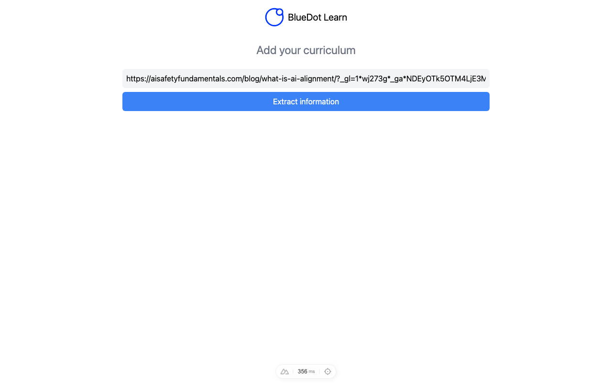

# 🔵 BlueDot Learn

Prototypes built in collaboration with BlueDot to improve the learning efficiency of their platform.



## Features

- 🎯 **Objectives page** — presents learning objectives to the user
- ❓ **Question flow** — `questions.vue` and `play.vue` drive an interactive Q&A / exercise flow
- 🤖 **AI-assisted content** — uses the `openai` SDK, with `cheerio` for scraping/parsing source content
- 🎨 **Icon-driven UI** — Heroicons via `unplugin-icons`

## Installation

```bash
git clone <this repo>
cd bluedot
npm install
```

## Configuration

Copy `.env.example` to `.env` and fill in:

- `OPENAI_API_KEY` — OpenAI API key, used by the `/api/question`, `/api/evaluate`, `/api/hint`, `/api/detect_objectives`, and `/api/detect_objectives_from_text` routes

Without it, the app builds and the pages load, but those API routes will error when called.

## Usage

```bash
npm run dev
```

Then open [http://localhost:3000](http://localhost:3000).

```bash
npm run build      # production build
npm run generate   # static generation
npm run preview    # preview production build
```

## Built with

- [Nuxt 3](https://nuxt.com/)
- [OpenAI API](https://platform.openai.com/)
- [Tailwind CSS](https://tailwindcss.com/)
- [Cheerio](https://cheerio.js.org/)

## Status

🚧 Prototype for an external collaborator (BlueDot) — a `mess/` directory in the repo suggests experimental/scratch content alongside the working pages.

⚠️ `npm install && npm run build` verified working as of 2026-09-03. API routes (`/api/question`, `/api/evaluate`, `/api/hint`, etc.) call OpenAI and require your own `OPENAI_API_KEY` in `.env`, which isn't provided here — build succeeds without it.
